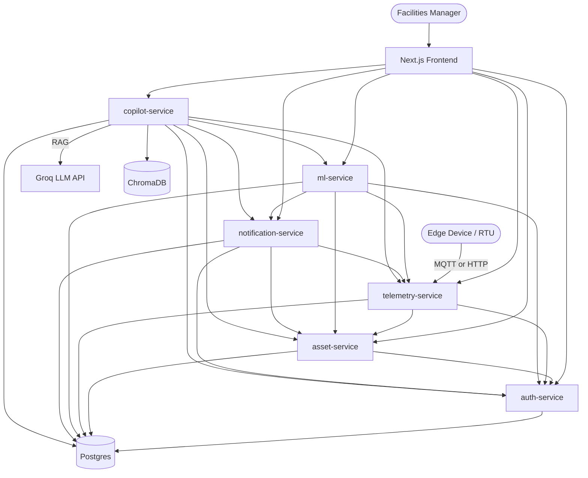

# Plenum Control (HVAC-FDD Pro)

A multi-tenant SaaS platform for HVAC fault detection and diagnosis. Ingests rooftop-unit (RTU) telemetry, runs trained ML classifiers to detect real equipment faults, explains predictions with SHAP, and provides a RAG-based AI copilot for facilities managers to ask natural-language questions about their equipment.

**Live**: [plenumcontrol.in](https://plenumcontrol.in)

Built solo as a portfolio project to demonstrate genuine production-SaaS engineering - real tests, real migrations, real security review, real deployment, not a demo shortcut. See [`docs/`](docs/) for the audit trail: OWASP self-check, load-test findings, backup strategy, and architecture decision records.

---

## What it does

- **Fault detection**: 8 trained classifiers (RandomForest, XGBoost, Isolation Forest) covering condenser fouling, evaporator fouling, refrigerant overcharge, liquid-line/suction-line restriction, and more. Argmax attribution resolves the real, documented problem of multiple classifiers firing on the same event, picking the single most-confident real answer instead of an arbitrary first match.
- **Explainability**: SHAP feature-importance for every prediction, showing exactly which sensor readings drove a given diagnosis.
- **AI copilot**: A hand-built agentic tool-calling loop (deliberately not a framework, for full inspectability) backed by RAG over real ASHRAE/DOE/LBNL technical fault documentation. Chains attribution and explanation together so the copilot's stated fault and its stated reasoning are always for the same model - and reports honestly when there isn't enough sensor data to diagnose anything, rather than defaulting to "no fault detected."
- **Real multi-tenant isolation**: organizations, facilities, assets, and asset types are genuinely isolated per-organization, RBAC-enforced (admin/operator/viewer) at the backend, not just hidden in the UI.
- **Ingestion**: CSV upload (long and wide format), a JSON bulk endpoint, a single-reading endpoint, and MQTT - all sharing the same duplicate-detection logic, so a retried or re-uploaded batch never silently creates duplicate data.
- **Sensor readiness**: cross-references each asset's actually-mapped sensors against what each trained model genuinely requires, telling you exactly what's missing before a prediction is even attempted - not a generic "not enough data" message.

## Architecture

Six independent FastAPI microservices, one database each, no cross-service foreign keys - each service owns its own data and is only ever reached through its own real API, never a shared table.

| Service | Responsibility |
|---|---|
| `auth-service` | JWT issuance, organizations, RBAC membership |
| `asset-service` | Facilities, asset types (org-scoped), assets, metric definitions |
| `telemetry-service` | Ingestion (HTTP, bulk, CSV, MQTT), metric mapping |
| `ml-service` | Predictions, fault attribution, SHAP explanation, baseline drift detection |
| `notification-service` | Alerts, facility reports |
| `copilot-service` | RAG + agentic chat |

Frontend is a Next.js (App Router) SPA, one API base URL per backend service. Caddy handles TLS termination and reverse-proxying in production, one subdomain per service.



See [`docs/adr/`](docs/adr/) for the real architectural decisions behind this shape (one-database-per-service, no hard deletes, shared JWT secret, etc.), and [`docs/DEPLOYMENT_RUNBOOK.md`](docs/DEPLOYMENT_RUNBOOK.md) for the actual, evidence-based deployment process.

## Tech stack

**Backend**: Python, FastAPI, SQLAlchemy, Alembic, PostgreSQL, Poetry
**ML**: scikit-learn, XGBoost, SHAP, joblib
**RAG/Copilot**: ChromaDB, `sentence-transformers` (BGE-small), Groq (LLM inference)
**Frontend**: Next.js (App Router), TypeScript, TanStack Query
**Infra**: Docker Compose, Caddy (reverse proxy + automatic TLS), GitHub Actions CI

## API documentation

Every service exposes real, auto-generated OpenAPI docs at `/docs` (Swagger UI) and `/redoc`:

- `https://auth.plenumcontrol.in/docs`
- `https://asset.plenumcontrol.in/docs`
- `https://telemetry.plenumcontrol.in/docs`
- `https://ml.plenumcontrol.in/docs`
- `https://notification.plenumcontrol.in/docs`
- `https://copilot.plenumcontrol.in/docs`

## Running locally

```bash
git clone https://github.com/sreehari-sreesunil/hvac-fdd-pro.git
cd hvac-fdd-pro
cp .env.example .env   # fill in real values - see .env.example's own comments
docker compose up -d
cd frontend && npm install && npm run dev
```

Frontend: `http://localhost:3000`. Each backend service's own `/health` endpoint and `/docs` are reachable on its assigned port (8000-8005).

## Testing

Every service has a real pytest suite (not stubs), run inside its own Docker environment to match the actual runtime (some dependencies, like `shap` and `chroma-hnswlib`, don't build on Windows and are Docker-only by design):

```bash
docker compose exec <service-name> poetry run pytest
docker compose exec <service-name> poetry run mypy app --config-file=pyproject.toml
```

CI runs the full matrix (pytest + mypy, blocking, not advisory) on every push - see [`.github/workflows/ci.yml`](.github/workflows/ci.yml).

## Known limitations

Documented honestly, not hidden:

- No automated off-site backup replication yet (backups run on a real cron schedule, but land on the same server they protect) - see [`docs/BACKUP_STRATEGY.md`](docs/BACKUP_STRATEGY.md).
- Single-instance deployment, no horizontal scaling or load balancing across multiple app servers.
- No Modbus/BACnet connectors yet - MQTT and HTTP/CSV are the current real ingestion paths.

See [`docs/OWASP_TOP_10_SELF_CHECK.md`](docs/OWASP_TOP_10_SELF_CHECK.md) and [`docs/LOAD_TEST_RESULTS.md`](docs/LOAD_TEST_RESULTS.md) for the full, evidence-based security and performance audit trail.

## License

Not yet licensed for reuse - portfolio project, all rights reserved by the author.
